# [Codenvy.io](https://codenvy.io/dashboard/#)
### การสร้าง workspace  
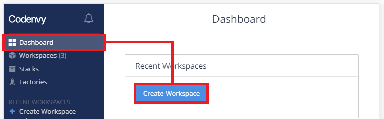  
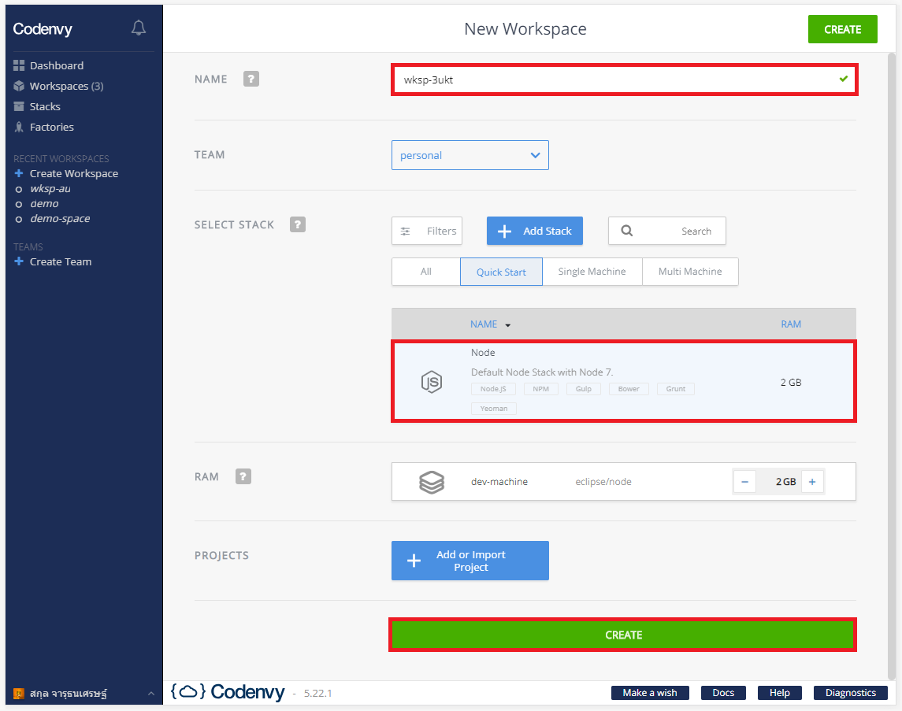  
### การตั้งค่า Ports และ Agents
  
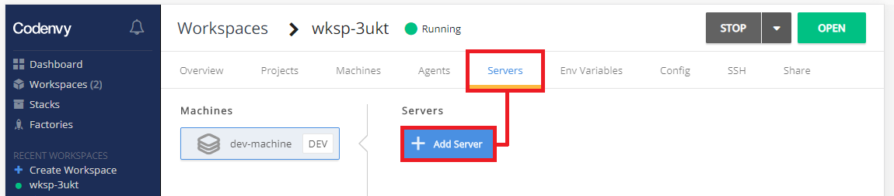  
  
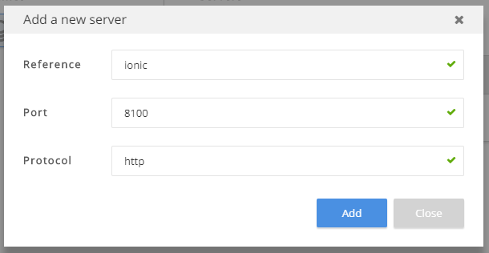  
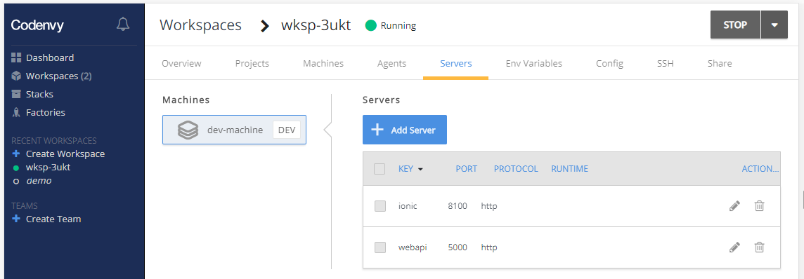  
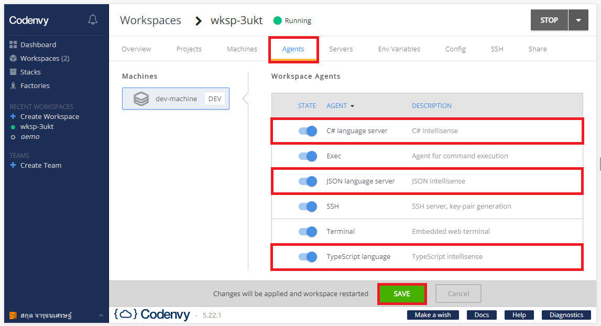  
### ลองใช้งาน VM  
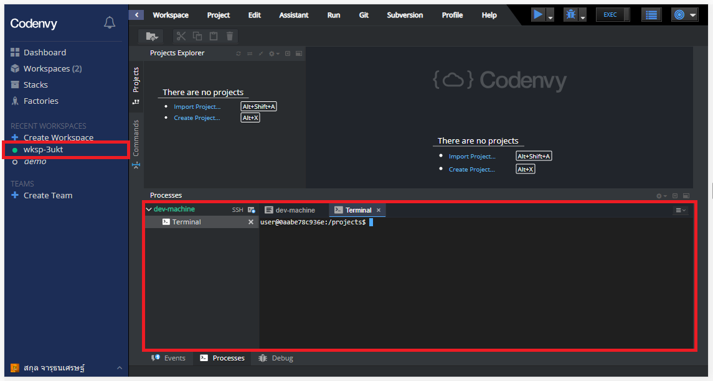

# [คำสั่งติดตั้ง Ionic CLI](https://ionicframework.com/getting-started#cli)  
```
sudo npm install -g ionic
```

# [คำสั่งติดตั้ง .NET Core - Ubuntu 14.04](https://www.microsoft.com/net/download/linux-package-manager/ubuntu14-04/sdk-current)
```
wget -q https://packages.microsoft.com/config/ubuntu/14.04/packages-microsoft-prod.deb
sudo dpkg -i packages-microsoft-prod.deb
sudo apt-get install apt-transport-https
sudo apt-get update
sudo apt-get install dotnet-sdk-2.1
```
> ขั้นตอนสุดท้ายมันจะถาม Y/n ให้กดปุ่ม **Enter** ได้เลย *(ส่วนตัวชอบใส่ y แล้วค่อยกดปุ่ม Enter)*

# ตรวจสอบเวอร์ชันหลังลงเสร็จ
```
ionic --version
```
> 4.1.2 (ควรจะเป็น version นี้หรือมากกว่า)

```
dotnet --version
```
> 2.1.402 (ควรจะเป็น version นี้หรือมากกว่า)

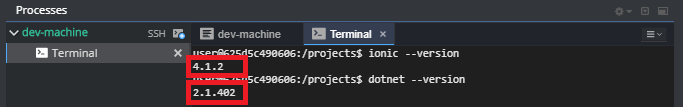  

### กรณีที่ dotnet ได้เป็นตัว preview (ไม่เจอให้ข้าม ทำบุญมาดีแล้ว)
ให้ลบ workspace นั้นๆออกเลย แล้วทำใหม่ตั้งแต่ต้น (ขั้นตอนการลบอยู่ในรูปถัดไป)
  
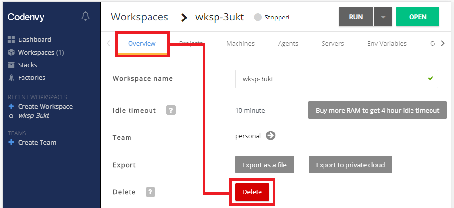  

# ข้อแนะนำ (ไม่ทำก็ได้ **แต่เตือนแล้วนะ**)
* หลังจากทำขั้นตอนด้านบนเสร็จหมดในครั้งแรกควร **ปิดเครื่อง** - มันจะได้เซฟทุกอย่างไว้ก่อน
* ถ้ารู้ว่าจะไม่ได้ใช้เครื่องนานๆและต้องการจะเซฟของในเครื่องไว้ให้ปิดเครื่องด้วย

# ปิดเครื่อง
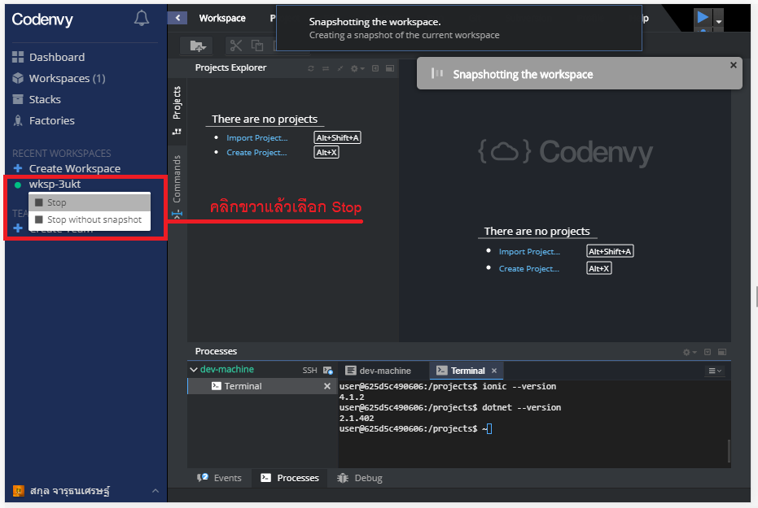  

# เปิดเครื่อง
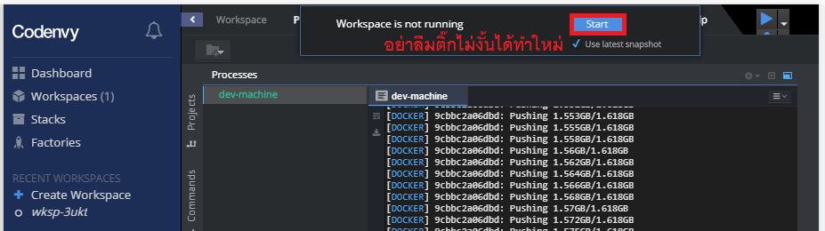  

# การแชร์ workspace
  
  
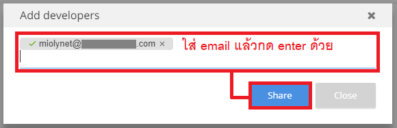  

# Command line (สำหรับ Linux)
เคลียหน้าจอ
```
clear
```
ออกจาก folder 1 step
```
cd ..
```
เข้าไปยัง path ที่กำหนด
```
cd PATH_TO_GO
```
ดูรายชื่อไฟล์+folder
```
dir
```
ดู process ทั้งหมด
```
ps -a
```
ทำลาย process
```
kill -9 PID
```

# เปิด terminal หลายๆตัว
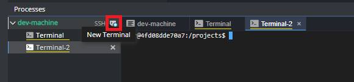  

---
# เรื่องอื่นๆ (กำลังทำ)
* [Web API](web-api.md)
* [Ionic](#)
* [TDD](#)
* [Git](#)
