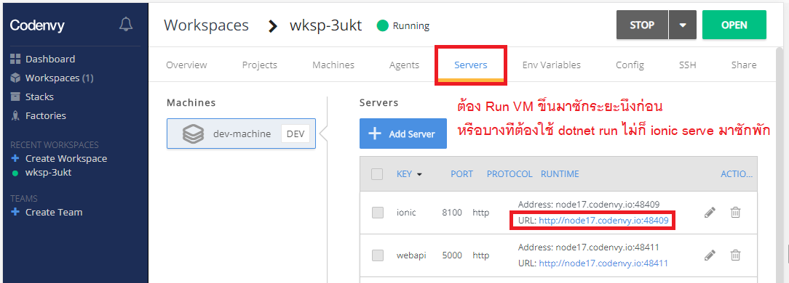
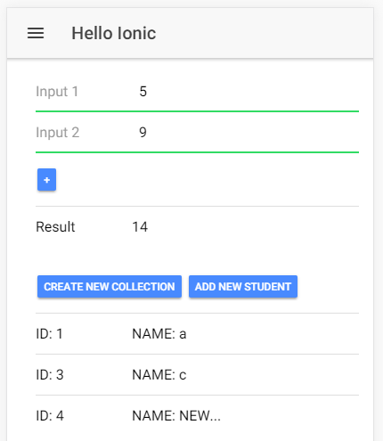

# Ionic

## สร้าง Ionic project
```
ionic start demoionic
```
> **demoionic** คือชื่อโปรเจคและจะได้ folder ชื่อนั้นด้วย *(ไม่เปลี่ยนก็แล้วแต่ - เตือนแล้วนะ)*

## การเข้า Ionic
```
ionic serve
```
> ต้องอยู่ใน folder ionic project แล้ว  

 
   

## เพิ่มหน้าใหม่
```
ionic g page YOUR_PAGENAME_HERE
```
> ต้องอยู่ใน folder ionic project แล้ว  

**src/app/app.module.ts**
```
import { YOUR_PAGENAME_HERE } from '../pages/YOUR_PAGENAME_HERE/YOUR_PAGENAME_HERE';

declarations: [
    YOUR_PAGENAME_HERE
]

entryComponents: [
    YOUR_PAGENAME_HERE
]
```

## การเปลี่ยนหน้า
**หน้าที่จะเรียกใช้**
```
import { NavController } from 'ionic-angular';

constructor(public navCtrl: NavController){
}
```
ตัวอย่าง - เปลี่ยนหน้าปรกติ
```
this.navCtrl.push(ENTER_PAGE_NAME_HERE);
```
ตัวอย่าง - เปลี่ยนหน้าโดยส่งข้อมูลไปด้วย (parameter)
```
this.navCtrl.push(ENTER_PAGE_NAME_HERE, 
{
      PROPERTY_NAME_1: VALUE_1,
      PROPERTY_NAME_2: VALUE_2
});
```

## การรับข้อมูลจากหน้าอื่นผ่าน parameter
**หน้าที่จะเรียกใช้**
```
import { NavParams } from 'ionic-angular';

constructor(public navParams: NavParams){
}
```
ตัวอย่าง
```
constructor(public navParams: NavParams){
    var VARIABLE_NAME_1 = navParams.get('PROPERTY_NAME_1');
    var VARIABLE_NAME_2 = navParams.get('PROPERTY_NAME_2');
}
```

## การเรียกใช้ HttpClient
**src/app/app.module.ts**
```
import { HttpClientModule } from '@angular/common/http'

imports: [
    HttpClientModule
]
```
**หน้าที่จะเรียกใช้**
```
import { HttpClient } from '@angular/common/http';

constructor(public http: HttpClient) {
}
```
ตัวอย่าง - GET
```
this.http.get<YOUR_MODEL_NAME_HERE>("ENTER_YOUR_API_HERE").subscribe(
    it => {
        // SUCCESS: Do something
    }, 
    error => {
        // ERROR: Do something
    });
```
ตัวอย่าง - POST
```
this.http.post<YOUR_MODEL_NAME>("ENTER_YOUR_API_HERE",
    {
        PROPERTY_NAME_1: VALUE_1,
        PROPERTY_NAME_2: VALUE_2
    }).subscribe(
        it => {
        // SUCCESS: Do something
        }, 
        error => {
            // ERROR: Do something
        });
```
ตัวอย่าง - PUT
```
this.http.put<YOUR_MODEL_NAME>("ENTER_YOUR_API_HERE",
    {
        PROPERTY_NAME_1: VALUE_1,
        PROPERTY_NAME_2: VALUE_2
    }).subscribe(
        it => {
            // SUCCESS: Do something
        }, 
        error => {
            // ERROR: Do something
        });
```
ตัวอย่าง - DELETE
```
this.http.delete<YOUR_MODEL_NAME>("ENTER_YOUR_API_HERE").subscribe(
    it => {
        // SUCCESS: Do something
    }, error => {
        // ERROR: Do something
    });

```

## Code example
**TypeScript**
```
export class HelloIonicPage {

  data1: number = 5;
  data2: number = 9;
  result: number;

  Add() {
    this.data1 = +this.data1;
    this.data2 = +this.data2;
    this.result = this.data1 + this.data2;
  }

  studentCollection: Student[];

  createDataCollection() {
    this.studentCollection = [
      { id: 1, name: "a" },
      { id: 2, name: "b" },
      { id: 3, name: "c" },
    ];
  }

  removeStudent(selectedStudent: Student) {
    var index = this.studentCollection.indexOf(selectedStudent);
    if (index > -1) {
      this.studentCollection.splice(index, 1);
    }
  }

  addAStudent() {
    if (!this.studentCollection) return;
    var newStudent = new Student();
    newStudent.id = this.studentCollection.length + 1;
    newStudent.name = "NEW-STUDENT";
    this.studentCollection.push(newStudent);
  }

}

export class Student {
  public id: number;
  public name: string;
}
```
**Page**
```
<ion-content padding>
  <ion-list>
    <ion-item>
      <ion-label fixed>Input 1</ion-label>
      <ion-input type="name" [(ngModel)]="data1"></ion-input>
    </ion-item>
    <ion-item>
      <ion-label fixed>Input 2</ion-label>
      <ion-input type="name" [(ngModel)]="data2"></ion-input>
    </ion-item>
    <ion-item>
      <button ion-button (click)="Add()">+</button>
    </ion-item>
    <ion-item>
      <ion-label fixed>Result</ion-label>
      <ion-label fixed>{{result}}</ion-label>
    </ion-item>
  </ion-list>

  <ion-list>
    <ion-item>
      <button ion-button (click)="createDataCollection()">Create new collection</button>
      <button ion-button (click)="addAStudent()">Add new student</button>
    </ion-item>
    <ion-item *ngIf="!studentCollection">
      studentCollection is undefined
    </ion-item>
    <ion-item *ngFor="let it of studentCollection" (click)="removeStudent(it)">
      <ion-label fixed>ID: {{ it.id }}</ion-label>
      <ion-label fixed>NAME: {{ it.name }}</ion-label>
    </ion-item>
  </ion-list>
</ion-content>
```
   

## Google's QR
```
https://chart.googleapis.com/chart?cht=qr&chs=250x250&chl=YOUR_TEXT_HERE
```
> chs: ขนาดรูป 250 x 250 (เปลี่ยนเอา)  
> chl: ข้อความที่จะส่งไปสร้างเป็น QR  


