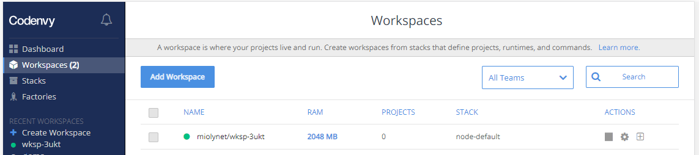
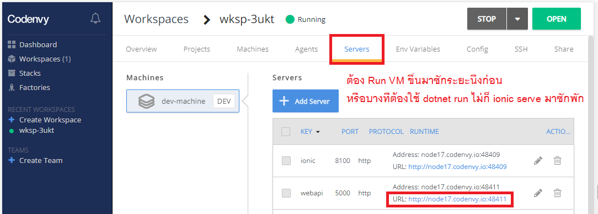
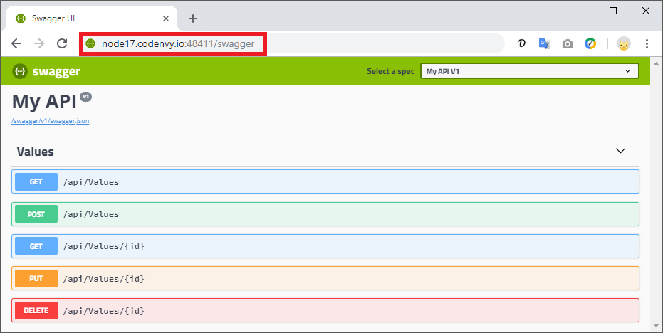
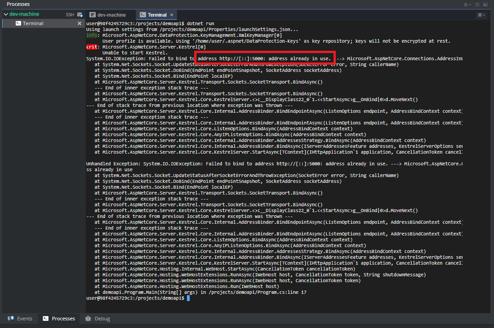
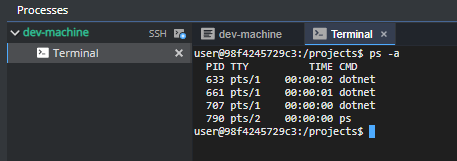
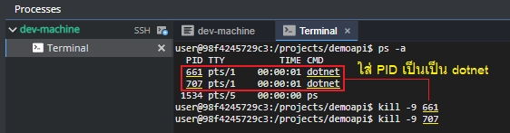

# Web API

## สร้าง Web API .NET Core
```
dotnet new webapi -n demoapi
```
> **demoapi** คือชื่อโปรเจคและจะได้ folder ชื่อนั้นด้วย *(ไม่เปลี่ยนก็แล้วแต่ - เตือนแล้วนะ)*

## เปิด Port 5000
**Program.cs**
```
public static IWebHostBuilder CreateWebHostBuilder(string[] args) =>
            WebHost.CreateDefaultBuilder(args)
                .UseUrls("http://*:5000")
                .UseStartup<Startup>();
```

## [การเปิด CORS](https://docs.microsoft.com/en-us/aspnet/core/security/cors?view=aspnetcore-2.1)
**Startup.cs**
```
public void Configure(IApplicationBuilder app, IHostingEnvironment env)
{
    app.UseCors(builder => builder.AllowAnyOrigin().AllowAnyMethod().AllowAnyHeader());
}
```

## [ติดตั้ง Swagger](https://docs.microsoft.com/en-us/aspnet/core/tutorials/getting-started-with-swashbuckle?view=aspnetcore-2.1&tabs=netcore-cli%2Cvisual-studio-xml)
```
dotnet add package Swashbuckle.AspNetCore
```
> ต้องอยู่ใน folder webapi แล้ว

**Startup.cs**
```
using Swashbuckle.AspNetCore.Swagger;
```
```
public void ConfigureServices(IServiceCollection services)
{
    services.AddSwaggerGen(c =>
    {
        c.SwaggerDoc("v1", new Info { Title = "My API", Version = "v1" });
    });
}

public void Configure(IApplicationBuilder app)
{
    app.UseSwagger();
    app.UseSwaggerUI(c => { c.SwaggerEndpoint("/swagger/v1/swagger.json", "My API V1"); });
}
```

## วิธีการเข้าเว็บ
```
dotnet run
```
> ต้องอยู่ใน folder webapi แล้ว  
  
  
  

## ปิด process
```
ใน terminal กด CTRL + C
```

## กรณี dotnet run ไม่ได้เพราะโดน lock process  
  
ใช้คำสั่งด้านล่าง - เพื่อลิสต์รายการ process ทั้งหมดที่ run อยู่
```
ps -a
```
  
ใช้คำสั่งด้านล่าง - เพื่อ terminate process นั้นๆออก (โดยใส่ PID)  
```
kill -9 ENTER_PID_HERE
```
  

## ลอง Call API จาก VS Code (REST Client)
1. ติดตั้ง [REST Client](https://marketplace.visualstudio.com/items?itemName=humao.rest-client) ใน Visual Studio Code ซะ  
2. สร้างไฟล์ใน VS Code แล้วเซฟเป็นนามสกุล .http
3. เอา Code ไปใส่ในไฟล์ที่สร้าง แล้วลองกด **Send Request** แต่ละอันดู (แก้ URL ให้เป็นของตัวเองด้วย)
```
GET http://node17.codenvy.io:48411/api/Values
###

GET http://node17.codenvy.io:48411/api/Values/123

###

POST http://node17.codenvy.io:48411/api/Values
Content-Type: application/json

"YOUR_TEXT_HERE"

###

PUT http://node17.codenvy.io:48411/api/Values/123
Content-Type: application/json

"YOUR_TEXT_HERE"

###

DELETE http://node17.codenvy.io:48411/api/Values/123
```
